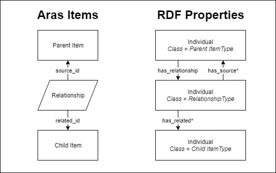

# Representing the Aras Data Model in RDF/OWL

## ItemTypes

Each Aras ItemType may be represented by an OWL class. 

All Aras Items share a core group of system properties, so we use one class - *Item* - that represents the concept of an Aras Item. All other ItemType-based classes are subclasses of this super class. 

Similarly, relationships Items also share a common set of properties, so we can use another class - *Relationship* - to represent this group of items. *Relationship* is a subclass of *Item*, and all ItemTypes where is_relationship=1 are subclasses of *Relationship*.

A poly ItemType in Innovator is an ItemType with a set of properties and one or more "poly sources", or ItemTypes which share the same set of properties. *Poly Item* is a subsclass of *Item*, and all ItemTypes where implementation_type='poly' are subclasses of *Poly Item*. Additionally, any ItemType that is a poly source of a poly ItemType will be a subclass of the poly ItemType's class.

All classes representing ItemTypes are disjoint with their sibling classes, as well as any children of their sibling classes.

## Properties

### Data Types
Aras properties may have one of 20 data types. See the table below for the recommended RDFS/OWL representation of each data type. Any of these datatypes could be overridden for specific ItemTypes depending on the ontology in use, but these seem like a good starting point.

Aras Data Type  | Aras Data Source  | Recommended Representation    | Notes
----------------|-------------------|-------------------------------|------
String          |                   | xsd:string                    |  
Text            |                   | xsd:string                    |  
Integer         |                   | xsd:int                       |  
Float           |                   | xsd:float                     |  
Decimal         |                   | xsd:decimal                   |  
Boolean         |                   | xsd:boolean                   |  
Date            |                   | xsd:dateTime                  |  
Image           |                   | xsd:url                       | An image property is either a path to a file on the server, or a string referring to a vaulted file. Should return the url of the vaulted file or server file. 
MD5             |                   | xsd:string                    |  
Sequence        | Sequence Item     | xsd:string                    |  
Item            | ItemType Item     | rdf:resource (Item URL)       | In Innovator, an Item property contains the id of an item of same type as the data source. In RDF, it would make more sense to use the URI of the item. 
List            | List Item         | xsd:string                    | This property contains the value selected from the list, which may be different from the label that is displayed in the Innovator client. 
Filter List     | List Item         | xsd:string                    | This property contains the value selected from the list, which may be different from the label that is displayed in the Innovator client. 
Color List      | List Item         | xsd:string                    | The value is a string representing a color (ex: hex or RGB). Could use a color data type intead of generic string. 
Color           |                   | xsd:string                    | The value is a string representing a color (ex: hex or RGB). Could use a color data type intead of generic string. 
Federated       |                   | xsd:string                    | This property value is generated on the fly by custom code when an item is retrieved. Can be any data type. Not commonly used.
Formatted Text  |                   | xsd:string                    | This field contains HTML content. 
Foreign         |                   | xsd:string                    | This property value is generated on the fly by server code when an item is retrieved. Data type is determined by the data type of the "pattern" property. 
Multilingual String |               | xsd:string                    | In the Innovator database, a multilingual string has one field for the English value, and one additional field for each installed language pack. This type of property will not be functional, pass a property for each language value.  
Multi Value List    |               | xsd:string                    | This property contains a comma-separated list of values selected from the list, which may be different from the labels that are displayed in the Innovator client. This type of property will not be functional, so we can split the string and pass a property for each selected value. 

### Object Properties vs. Data Properties

Generally speaking, Aras Item properties will be represented by Object Properties and most other property types will be represented by Data Properties. 

### Axioms

#### Functional
>*An individual may have at most one value for a property that is functional.*

Most Aras properties represented as Data Properties will be functional. The only exceptions should be Aras properties with a data type of "multilingual string" or "multi value list". These property types may have more than one value per individual.

All Aras properties represented as Object Properties will be functional. 

The "has_relationship" property should be the only non-functional Object Property on an individual representing an Aras Item. This is because Items may have multiple relationships to other Items.

<!-- #### Inverse Functional 
>*An individual may .*

Most Object Properties will not be Inverse Functional. The Aras data model rarely allows an Item to be referenced by only a single other Item.  -->

<!-- #### Transitive -->

<!-- #### Symmetric -->

<!-- #### Asymmetric
>*If an individual X is connected to individual Y by a property that is reflexive, Y cannot be connected to X by that same property.*

Most Aras properties represented by Object Properties will be asymmetric. Items referenced by an item property typically do not have a property pointing back to the original item.

**Example:** Part-0001 - owned_by_id - Mike Miller  -->

<!-- #### Reflexive -->

#### Irreflexive
>*An individual may not be connected to itself by a property that is irreflexive.*

No Aras Item may be related to itself, so all Object Properties representing Relationships are irreflexive. Ex: has_related, related_id, has_relationship, source_id, has_source

## Relationships

Relationship items are represented by individuals of a class corresponding to the items' ItemType, just like any other type of Aras item described above. The following diagram shows how an Aras item, its relationship(s), and child item(s) may be represented in RDF.

The individual representing the relationship item has four properties that may reference the parent and child items - has_source, has_related, source_id, and related_id. The has_source property is equivalent to the source_id property, and has_related is equivalent to related_id. Source_id and related_id are properties in the Aras data model. Has_source and has_related only exist in the RDF/OWL ontology.

Note that a relationship may not have a child item. This is a null relationship in Innovator, and a valid scenario.

The RDF/OWL ontology includes a has_relationship Object Property on the individual representing the parent item in Aras. There is no corresponding property in the Aras data model. We only use it in RDF to form the triple to connect a parent item to its relationships.
