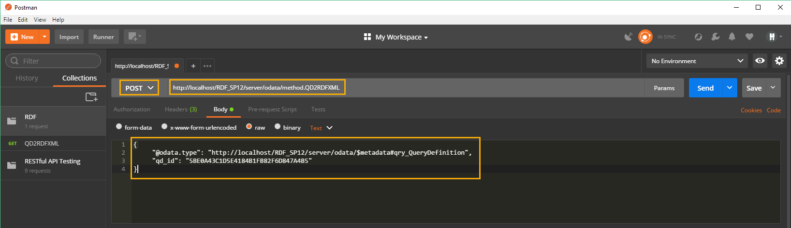
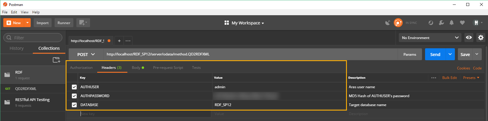
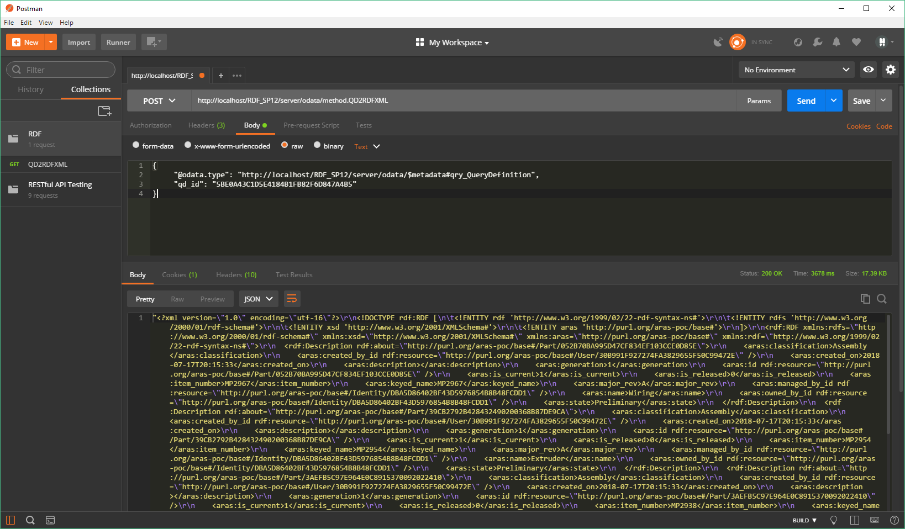

# Aras RESTful API Sample Code

## How It Works

Like [the approach we used with Aras 11 SP10](./Samples/RDFXML/RDFXML.md), this sample code uses a server method to execute a Query Definition and convert the output to RDF/XML. However, here we'll use the Aras RESTful API/OData Interface instead of an external web service.

## Installation

#### Important!

**Always back up your code tree and database before applying an import package or code tree patch!**

### Pre-requisites

1. Aras Innovator installed (version 11.0 SP12+)
2. Aras Package Import Utility
3. aras.labs.poc.RDF import package
4. RDF POC code tree overlay
5. An HTTP/REST client like [Postman](https://www.getpostman.com/) or [Insomnia](https://insomnia.rest/)

### Install Steps

#### The Database

1. Backup your database and store the BAK file in a safe place.
2. Open up the Aras Package Import tool.
3. Enter your login credentials and click **Login**
    * _Note: You must login as root for the package import to succeed!_
4. Enter the package name in the TargetRelease field.
    * Optional: Enter a description in the Description field.
5. Enter the path to your local `..\RDF\Import\imports.mf` file in the Manifest File field.
6. Select **aras.labs.poc.RDF** in the Available for Import field.
7. Select Type = **Merge** and Mode = **Thorough Mode**.
8. Click **Import** in the top left corner.
9. Close the Aras Package Import tool.

#### The Code Tree

1. Backup your code tree and store the copy in a safe place.
2. Copy the Innovator folder from `..\RDF\CodeTree`.
3. Paste the Innovator folder into the root installation directory for your Aras installation. This is the location of the `InnovatorServerConfig.xml` file.

> Note: If you have made any customizations to the `Innovator\Server\method_config.xml` file, you will need to manually merge these changes with your customizations. You may have a customized method_config.xml file if you have certain Aras applications installed or you have modified it to use third party DLLs.

#### The Sample Data (Optional)

1. Open up Nash in your browser. (http://localhost/{webalias}/Client/scripts/nash.aspx)
2. Select the target database from the dropdown list.
3. Enter your login credentials and click the **Login** button.
4. Open `Data/test_data.xml` from the RDF project repository and copy the contents.
5. In Nash, paste the test data AML into the **XML** textbox.
6. Click the **Submit** button to create the test data in the target database.

> Note: This action will only work once. If you want to recreate the test data in your database, you will need to first delete all test data items.

## Usage 

1. Open up your HTTP/REST client.
2. Create a new **POST** request.
3. Enter the url for your request: `http://localhost/{webalias}/server/odata/method.QD2RDF`
4. Enter the body for your request, where the value for **qd_id** is the id of your Query Definition:
    ```
    {
        "@odata.type": "http://localhost/RDF_SP12/server/odata/$metadata#qry_QueryDefinition", 
        "qd_id": "5BE0A43C1D5E4184B1FB82F6D847A4B5"
    }
    ```
5. Enter the headers for your request:
    * **AUTHUSER**: Aras user name
    * **AUTHPASSWORD**: MD5 hash of AUTHUSER's password
    * **DATABASE**: Target database name
6. Click **Send** to send your request to the server.

### Setup


*Setting up the request url and body in Postman.*


*Setting up the request headers in Postman.*

### Result


*Viewing the RDF/XML string response in Postman.*

[See the sample result here.](odata-interface-result.json)